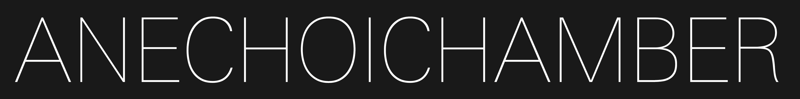
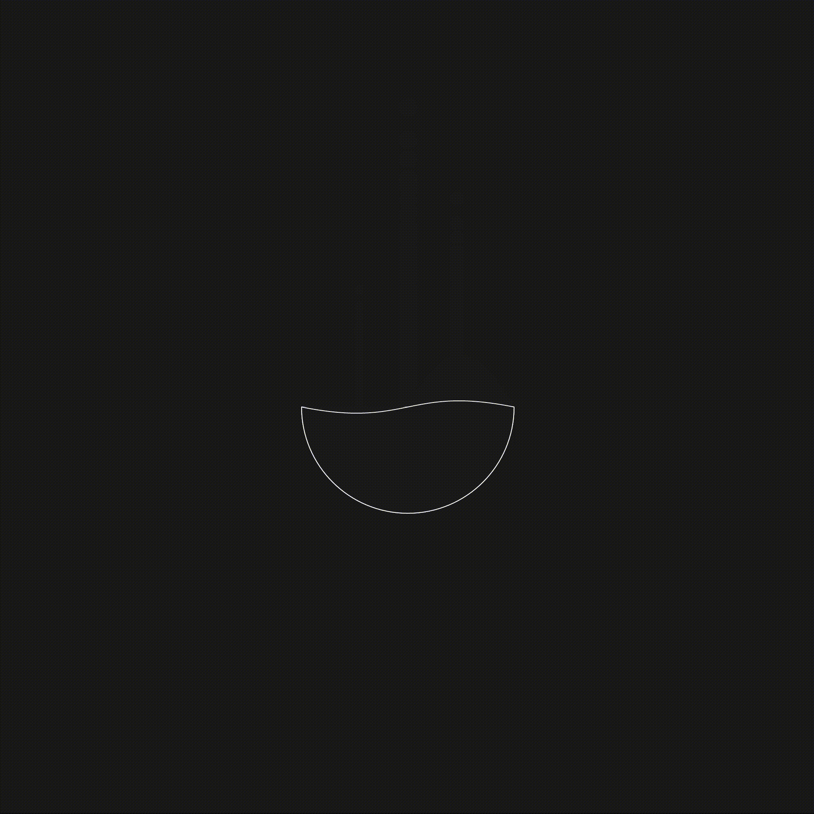
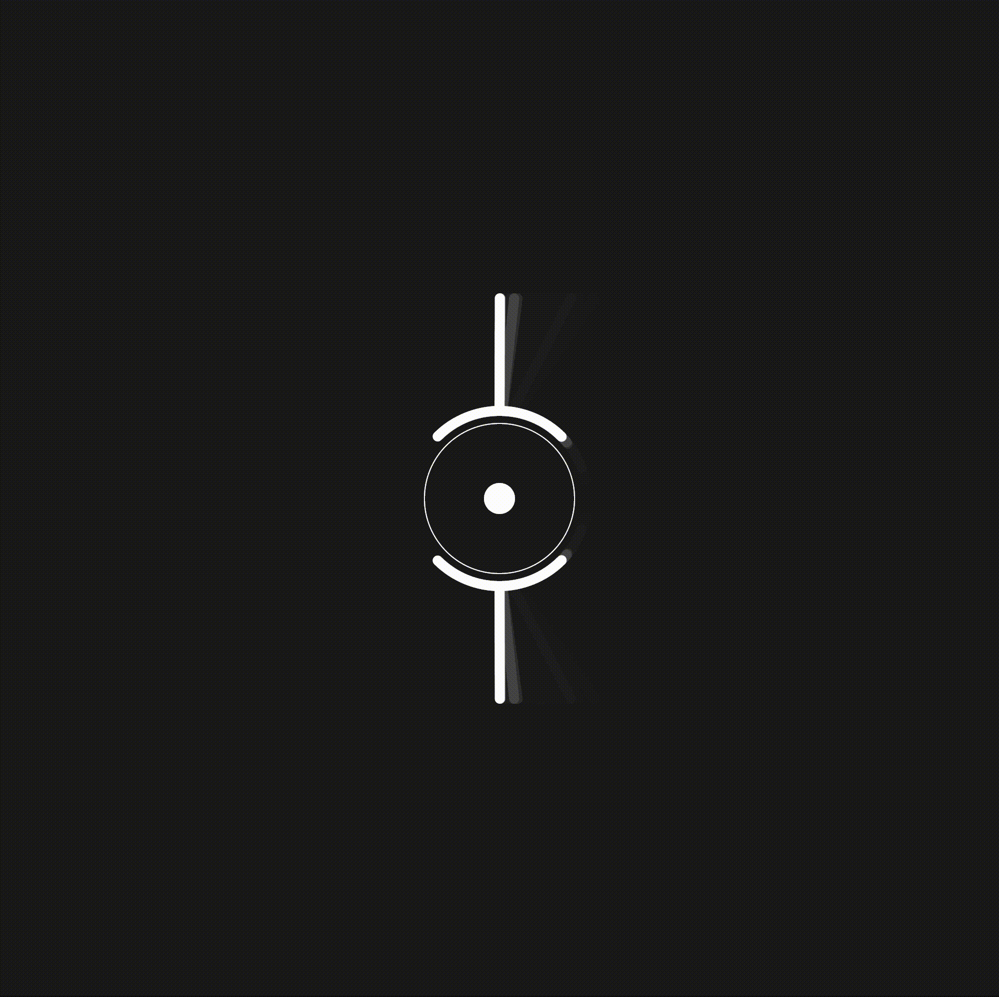
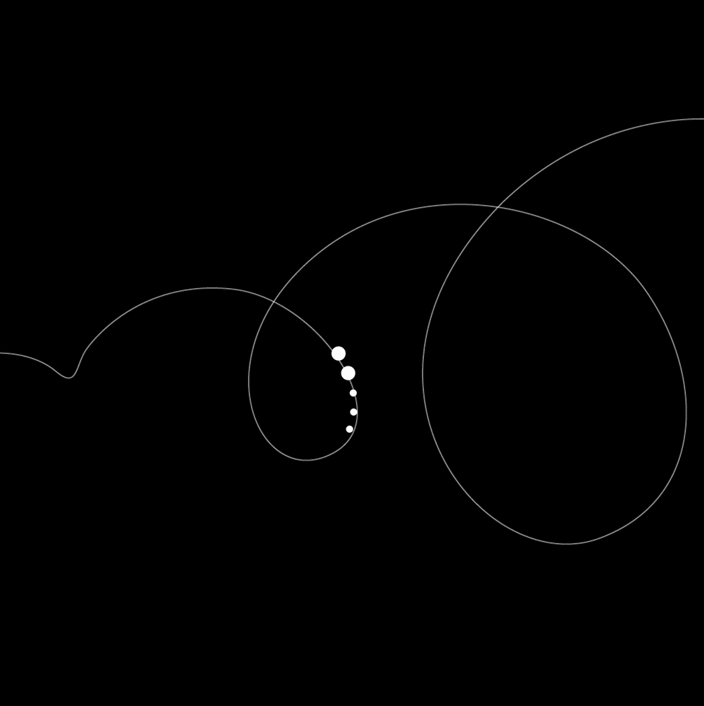

# About

**ANECHOICHAMBER** is a university project built in [p5.js](https://p5js.org/) during the course *Creative Coding* at the Politecnico di Milano.<br> The goal was to develop an interactive app depicting the audio sensations you feel when entering an anechoic chamber.

# Contents

- [Project idea](#project-idea)
- [Developement](#developement)
- [Keys interaction](#keys-interaction)
- [Challenges](#challenges)
- [Rules of the game](rules)
- [Team](#team)

# Project idea

The theme we chose is the **anechoic chamber**, a room covered with audio-absorbent material, able to gain a level of silence below 0db. The user has the chance to take an experience otherwise impossible without having access to one of these chambers, which are very expensive to build, not many around the world, and quite difficult to have access to.

# Developement
To create the room, we designed it as a background image in Cinema4D.<br>
To code the app we mostly used Javascript (with [p5.js](https://p5js.org/))—relying thoroughly on the background image function—and in support to it we also used HTML and CSS.

The following examples were written using this library.
## **Create the room**


## **Create animation**

* **Lungs**


```
function Breath() {
   var vol1 = analyser1.getLevel();
   noFill();
   stroke(255);
   strokeWeight(10);
   line(width/2,height/2-200-vol1*800,width/2,height/2+200-vol1*800);

   strokeWeight(1);
   quad(width/2-15,height/2+300+vol1*300,width/2-250-vol1*500,height/2+300+vol1*300,width/2-150-vol1*500,height/2-120-vol1*300,width/2-15,height/2-120-vol1*300);
   quad(width/2+15,height/2+300+vol1*300,width/2+250+vol1*500,height/2+300+vol1*300,width/2+150+vol1*500,height/2-120-vol1*300,width/2+15,height/2-120-vol1*300);

}
```


* **Heart**


```
function Heartbeat() {
   noFill();
   stroke(255);
   strokeWeight(1);
   var vol2 = analyser2.getLevel();
   ellipse (width/2,height/2,500-vol2*800);

   noStroke();
   fill(255);
   ellipse(width/2,height/2,vol2*200);
 
}
```
* **Gnash**


```
function Gnash() {
   var vol3 = analyser3.getLevel();
   noFill();
   stroke(255);
   strokeWeight(10);
   line(width/2+220+vol3*1200-125,height/2-70,width/2-220+vol3*1200-125,height/2-70);
   line(width/2-220-vol3*1200+125,height/2+170,width/2+220-vol3*1200+125,height/2+170);

   strokeWeight(1);
   rect(width/2+220+vol3*1200-175,height/2-52,100,100);
   rect(width/2+110+vol3*1200-175,height/2-52,100,100);
   rect(width/2+vol3*1200-175,height/2-52,100,100);
   rect(width/2-110+vol3*1200-175,height/2-52,100,100);
   rect(width/2-220+vol3*1200-175,height/2-53,100,100);
   
   rect(width/2+220-vol3*1200+75,height/2+53,100,100);
   rect(width/2+110-vol3*1200+75,height/2+53,100,100);
   rect(width/2-vol3*1200+75,height/2+53,100,100);
   rect(width/2-110-vol3*1200+75,height/2+53,100,100);
   rect(width/2-220-vol3*1200+75,height/2+53,100,100);

}
```

* **Skin**


```
function Skin() {
   var vol4 = analyser4.getLevel();
   noFill();
   stroke(255);
   strokeWeight(1);
   polygon(width/2-75,height/2-75,60-vol4*200,6);
   
   strokeWeight(10);
   line(width/2-75+10*vol4*50,height/2-75,width/2-75-10*vol4*50,height/2-75);

}

function polygon(x, y, radius, npoints) {
  var angle = TWO_PI / npoints;
  beginShape();
  for (var a = 0; a < TWO_PI; a += angle) {
    var sx = x + cos(a) * radius;
    var sy = y + sin(a) * radius;
    vertex(sx, sy);
  }
  endShape(CLOSE);
}
```
* **Stomach**



```
function Stomach() {
   var vol5 = analyser5.getLevel();
   
   fill(255);
   ellipse(width/2,(height/2+80)-100*vol5*20,20,20);
   ellipse(width/2-60,(height/2+80)-100*vol5*10,10,10);
   ellipse(width/2+60,(height/2+80)-100*vol5*15,15,15);
   
   fill(30);
   stroke(255);
   strokeWeight(1);
   arc(width/2,height/2,260,260,0,PI);
   bezier(width/2-130,height/2,width/2,height/2+65*vol5*15,width/2,height/2-65*vol5*15,width/2+130,height/2);

}
```

* **Joints**



```
function Joint() {
   var vol6 = analyser6.getLevel();
   noFill();
   stroke(255);
   strokeWeight(1);
   ellipse(width/2,height/2,150,150);
   fill(255);
   ellipse(width/2,height/2,30,30);
   
   noFill();
   strokeWeight(10);

   line(width/2+vol6*100,height/2-90,width/2+vol6*500,height/2-200);
   arc(width/2,height/2,175,175,(3*PI/2-PI/4)+vol6*3,-PI/4+vol6*3);
   
   line(width/2+vol6*100,height/2+90,width/2+vol6*500,height/2+200);
   arc(width/2,height/2,175,175,PI/4-vol6*3,3*PI/4-vol6*3);
  
}
```


* **Blood**



```
function fblood() {
  
  var volumeblood = analyser5.getLevel()*20000;
  ssss++
  s = ssss+volumeblood
  s1 = s*0.9
  
  background(0)
  image(traccia,0,170)
  
  fill(255)
  noStroke()
  push()
  translate(s,height/2)
  rotate(s)
  ellipse(s/3,0,20)
  pop()
  
  
  s2 = ssss+volumeblood*2

  push()
  translate(s2,height/2)
  rotate(s2)
  ellipse(s2/3,0,20)
  pop()
  
  
  s3 = ssss+volumeblood*3

  push()
  translate(s3,height/2)
  rotate(s3)
  ellipse(s3/3,0,10)
  pop()
  
  s4 = ssss+volumeblood*4

  push()
  translate(s4,height/2)
  rotate(s4)
  ellipse(s4/3,0,10)
  pop()
  
  s5 = ssss+volumeblood*5

  push()
  translate(s5,height/2)
  rotate(s5)
  ellipse(s5/3,0,10)
  pop()


  if(volumeblood===0){ssss=0}
  
}
```

* **Brain**


```
function Brain() {
   noFill();
   stroke(255);
   var spectrum = fft.analyze();

   beginShape();
   for (i = 0; i<spectrum.length; i++) {
   vertex(i, map(spectrum[i]*3, 0, 255, height/2, 0));
   }
   endShape();
   
}

```


## Keys interaction


## Challenges
The main challenge was to develop a coherent interaction, therefore we had to code a whole sequence for keeping track of the many keys pressed together. 
The second challenge was to find or to create appropriate sounds to convey the actual experience of a true chamber. Finally, when we finished all the different animations, another issue began when we had to put it all together.

## Rules of the game

# Team
**ANECHOICHAMBER** is developed by:
* Ruggero Accardo
* Emilio La Mura
* Tobia Scapin

### And you, do you know what sounds your body really makes?
Share this on social media if you managed to resist till the end, using the hashtag **#anechoichamber**
